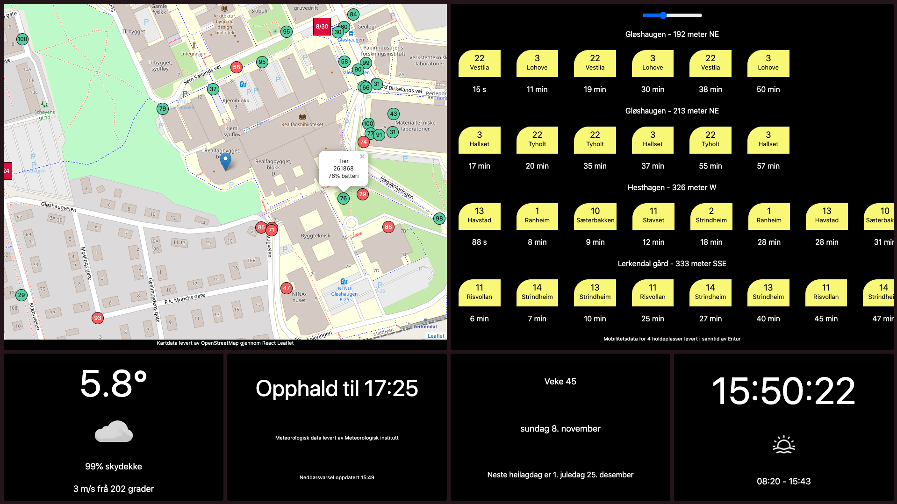
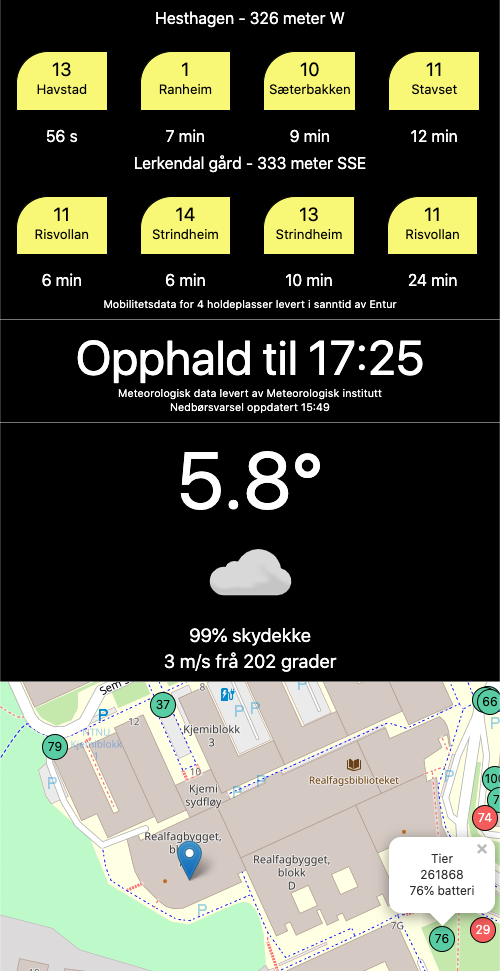

# skjer.men

Information screen web application built with [React](https://github.com/facebook/react).

The following data should be visible in skjer.men:
- [Real-time precipitation data](https://api.met.no/weatherapi/nowcast/0.9/documentation)
- [Current weather - temperature, cloud coverage, and winds](https://api.met.no/weatherapi/locationforecast/1.9/documentation)
- [Real-time public transport departures](https://developer.entur.org/pages-journeyplanner-journeyplanner/)
- [Real-time information on city bikes](https://developer.entur.org/pages-mobility-docs-bikeservice)
- [Real-time information on electrical scooters from Voi, Tier, Zvipp, Bolt and Lime](https://developer.entur.org/pages-mobility-docs-scooters/)
- [The next public holiday](https://data.norge.no/data/stavanger-kommune/helligdagskalender)

## Available Scripts

In the project directory, you can run:

### `yarn install`
### `yarn start`
### `yarn build`

This project was bootstrapped with [Create React App](https://github.com/facebook/create-react-app).
